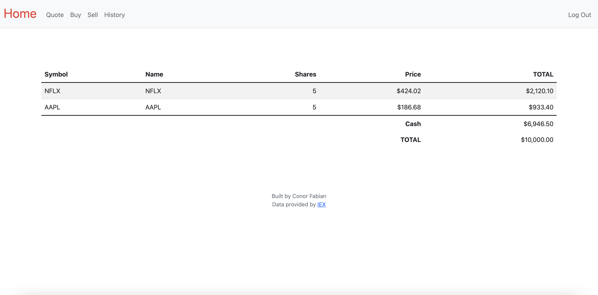

# Stock-Trading-Web-App
Developed a web-based stock trading application using Flask, Python, SQL, HTML, and CSS

* Implemented user authentication, allowing users to create accounts, log in, and manage their portfolios. Users are stored in an SQL database upon registration and then verified when logging in.
* 
* Integrated the IEX Cloud API to retrieve real-time stock prices and provided users with the ability to buy and sell stocks. Upon registration users are provided with a fake $10,000 to buy stocks with.
* 
* 
* Implemented a transaction history feature that logged all user transactions, either purchasing or selling stocks. Also implemented a main page that  calculates and displays total portfolio value broken down into individual stocks and their current worth.
* 
* 
* Designed a user-friendly interface using HTML and CSS, allowing users to easily navigate and interact with the application.
